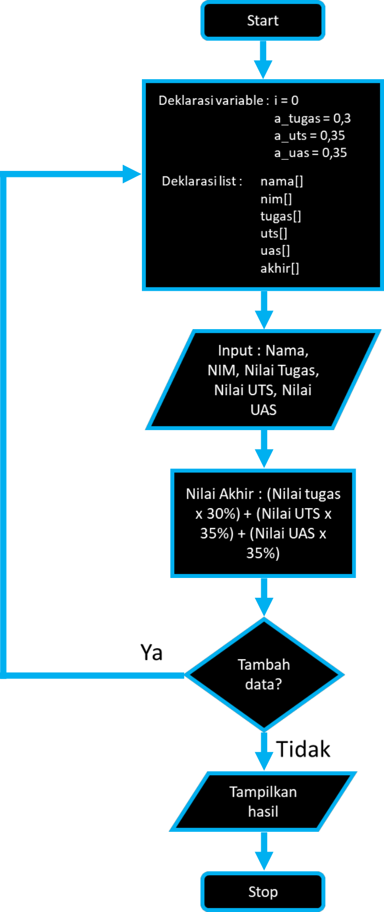
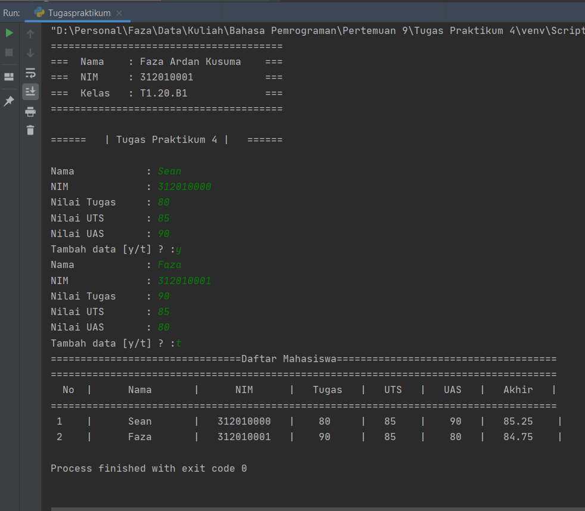

# labspy04

**Nama  : Faza Ardan Kusuma<br>
NIM     : 312010001<br>
Kelas   : TI.20.B1**

## Pertemuan 9 - Tugas Praktikum 4
Pada pertemuan ke 9 ini ada dua tugas praktikum, yaitu Praktikum 4 (labspy04) & 5 (labspy05). Disini saya akan membahas tugas 4 yang tugasnya adalah membuat list data mahasiswa sederhana, berikut adalah tugasnya.<br>
<br>
Dan nanti outputnya seperti berikut <br>
<br>

Pertama - tama membuat flowchartnya terlebih dahulu<br>
<br>

berikut adalah **source code** dari tugas 9
```python
print("=======================================")
print("===\t Nama \t : Faza Ardan Kusuma \t===")
print("===\t NIM \t : 312010001 \t\t\t===")
print("===\t Kelas \t : T1.20.B1 \t\t\t===")
print("=======================================")
print()
print("======\t | Tugas Praktikum 4 |\t ======")
print()

i = 0
a_tugas = float(0.3)
a_uts = float(0.35)
a_uas = float(0.35)
nama = []
nim = []
tugas = []
uts = []
uas = []
akhir = []


while True :
    s_nama = input("Nama \t\t\t: ")
    nama.append(s_nama)
    i_nim = int(input("NIM \t\t\t: "))
    nim.append(i_nim)
    i_tugas = int(input("Nilai Tugas \t: "))
    tugas.append(i_tugas)
    i_uts = int(input("Nilai UTS \t\t: "))
    uts.append(i_uts)
    i_uas = int(input("Nilai UAS \t\t: "))
    uas.append(i_uas)

    akhir = (a_tugas * i_tugas) + (a_uts*i_uts) + (a_uas*i_uas)
    akhir.append(akhir)

    ulang = ""
    while ulang!="y" and ulang!="t" :
        ulang = input("Tambah data [y/t] ? :")
    i += 1
    if ulang == "t" :
        break

print("================================Daftar Mahasiswa=====================================")
print("=====================================================================================")
print("  No  |      Nama       |      NIM      |   Tugas   |   UTS   |   UAS   |   Akhir   | ")
print("=====================================================================================")
for n in range(i):
    print("" ,n+1, "   |     " ,nama[n],"      |  ",nim[n],"  |   ",tugas[n],"    |  ",uts[n],"   |   ",uas[n],"  |  ",akhir[n],"   |")

```
Penjelasan :
* Pertama masukkan deklarasi variable dan list
    ```python
    i = 0
    a_tugas = float(0.3)
    a_uts = float(0.35)
    a_uas = float(0.35)
    nama = []
    nim = []
    tugas = []
    uts = []
    uas = []
    akhir = []
    ```
  **i = 0**, menjelaskan banyaknya data
  **a_tugas = float(0.3), a_uts = float(0.35), a_uas = float(0.35)**, sebagai perkalian persentase untuk menghitung nilai akhir
  **nama = [], nim = [], tugas = [], uts = [], uas = [], akhir = []**, sebagai penampung list data yang akan dimasukkan, karena data untuk pertama kalinya tidak ada / kosong, lalu kita baru menginputkan data
  
* Disini untuk penginputan data, menggunakan statement ***while***
    ```python
    while True :
        s_nama = input("Nama \t\t\t: ")
        nama.append(s_nama)
        i_nim = int(input("NIM \t\t\t: "))
        nim.append(i_nim)
        i_tugas = int(input("Nilai Tugas \t: "))
        tugas.append(i_tugas)
        i_uts = int(input("Nilai UTS \t\t: "))
        uts.append(i_uts)
        i_uas = int(input("Nilai UAS \t\t: "))
        uas.append(i_uas)
    
        akhir = (a_tugas * i_tugas) + (a_uts*i_uts) + (a_uas*i_uas)
        total.append(akhir)
    ```
  Source code diatas, selain penginputan nama, menggunakan integer<br>
  Karena ada perhitungan pada nilai akhir maka dituliskan rumus untuk perhitungan nilai akhir seperti source code diatas<br>
  **nama.append(s_nama)**, untuk menampung nama yang telah di masukkan kedalam list, berlaku juga untuk nim, tugas, uts, uas & akhir<br>
  Fungsi dari **xxxx.append(xx)** adalah untuk menambahkan elemen, atau menambahkan item ke dalam list / daftar
  
* Untuk perulangan penambahan data, menggunakan source code berikut
    ```python
    ulang = ""
        while ulang!="y" and ulang!="t" :
            ulang = input("Tambah data [y/t] ? :")
        i += 1
        if ulang == "t" :
            break
    ```
  Jadi setelah menambahkan data, maka akan muncul pertanyaan apakah ingin menambahkan data atau tidak<br>
  **i+= 1**, berfungsi untuk menandakan bahwa setelah menambahkan data maka datanya berarti bertambah 1, yang sebelumnya di state **i = 0** atau tidak ada data, dan kalau menambah data lagi maka i akan bertambah lagi sesuai dengan berapa data yang akan di masukkan / di input
  
* Untuk output tabel maka dibuat seperti berikut 
    ```python
    print("================================Daftar Mahasiswa=====================================")
    print("=====================================================================================")
    print("  No  |      Nama       |      NIM      |   Tugas   |   UTS   |   UAS   |   Akhir   | ")
    print("=====================================================================================")
    ```
  **= , |**, hanya berfungsi untuk membentuk tabel saja
  

* Untuk output di dalam tabel menggunakan range
    ```python
        for n in range(i):
            print("" ,n+1, "   |     " ,nama[n],"      |  ",nim[n],"  |   ",tugas[n],"    |  ",uts[n],"   |   ",uas[n],"  |  ",total[n],"   |")
    ```
  **for n in range(i):**, untuk memetakan data yang di input ke dalam tabel dengan range **i**, yaitu sesuai jumlah berapa data yang telah dimasukkan
  **n+1**, untuk menampilkan nomor 
  **nama[n]**, menampilkan nama sesuai dengan data yang di input, berlaku sama untuk nim, nilai tugas, uts, uas & akhir


Dan untuk output dari source code diatas <br>
<br>
Disini saya hanya memasukkan 2 data saja, bila ingin menambah data maka saat muncul pertanyaan **"Tambah data[y/t]"**, ketik **"y"** untuk menambahkan data lagi dan ketik **"t"** untuk berhenti memasukkan data dan melihat outputnya<br>

Sekian, Terima kasih

**================================================================**<br>
**==========================FAZA ARDAN KUSUMA=======================**<br>
**==============================312010001============================**<br>
**===============================TA.20.B1============================**<br>
**=============================TERIMA KASIH=========================**<br>
**================================================================**