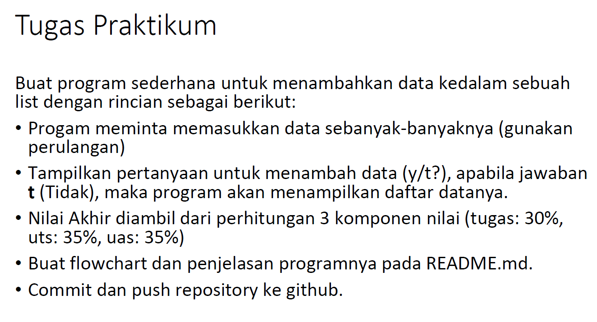
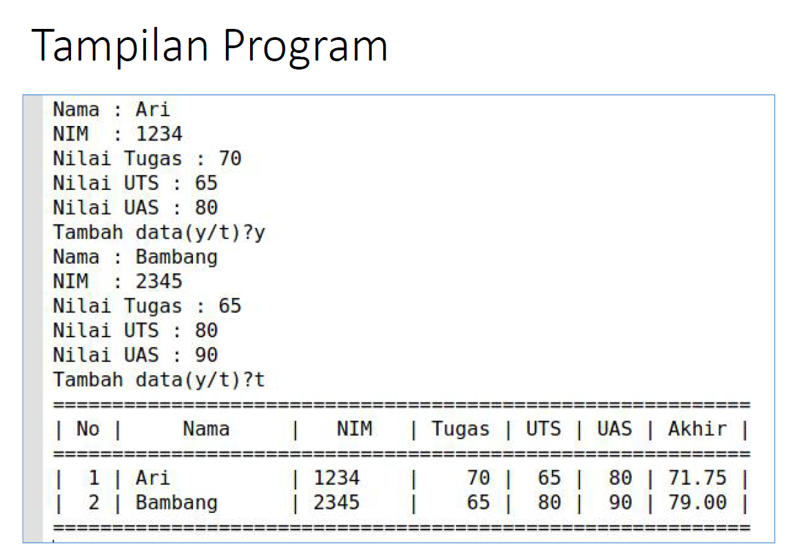

# labspy04

**Nama  : Faza Ardan Kusuma<br>
NIM     : 312010001<br>
Kelas   : TI.20.B1**

## Pertemuan 9 - Tugas Praktikum 4
Pada pertemuan ke 9 ini ada dua tugas praktikum, yaitu Praktikum 4 (labspy04) & 5 (labspy05). Disini saya akan membahas tugas 4 yang tugasnya adalah membuat list data mahasiswa sederhana, berikut adalah tugasnya.<br>
<br>
Dan nanti outputnya seperti berikut <br>
<br>

Pertama - tama membuat flowchartnya terlebih dahulu<br>
<br>

berikut adalah **source code** dari tugas 9
```python
print("=======================================")
print("===\t Nama \t : Faza Ardan Kusuma \t===")
print("===\t NIM \t : 312010001 \t\t\t===")
print("===\t Kelas \t : T1.20.B1 \t\t\t===")
print("=======================================")
print()
print("======\t | Tugas Praktikum 4 |\t ======")
print()

i = 0
a_tugas = float(0.3)
a_uts = float(0.35)
a_uas = float(0.35)
nama = []
nim = []
tugas = []
uts = []
uas = []
akhir = []


while True :
    s_nama = input("Nama \t\t\t: ")
    nama.append(s_nama)
    i_nim = int(input("NIM \t\t\t: "))
    nim.append(i_nim)
    i_tugas = int(input("Nilai Tugas \t: "))
    tugas.append(i_tugas)
    i_uts = int(input("Nilai UTS \t\t: "))
    uts.append(i_uts)
    i_uas = int(input("Nilai UAS \t\t: "))
    uas.append(i_uas)

    akhir = (a_tugas * i_tugas) + (a_uts*i_uts) + (a_uas*i_uas)
    total.append(akhir)

    ulang = ""
    while ulang!="y" and ulang!="t" :
        ulang = input("Tambah data [y/t] ? :")
    i += 1
    if ulang == "t" :
        break

print("================================Daftar Mahasiswa=====================================")
print("=====================================================================================")
print("  No  |      Nama       |      NIM      |   Tugas   |   UTS   |   UAS   |   Akhir   | ")
print("=====================================================================================")
for n in range(i):
    print("" ,n+1, "   |     " ,nama[n],"      |  ",nim[n],"  |   ",tugas[n],"    |  ",uts[n],"   |   ",uas[n],"  |  ",total[n],"   |")

```
Penjelasan :
* 